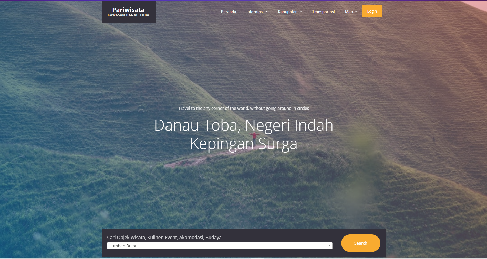
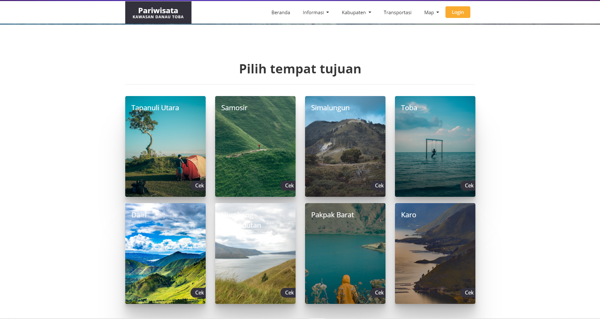
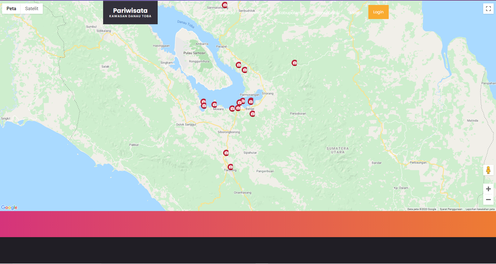
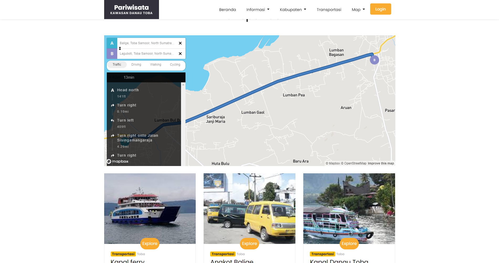
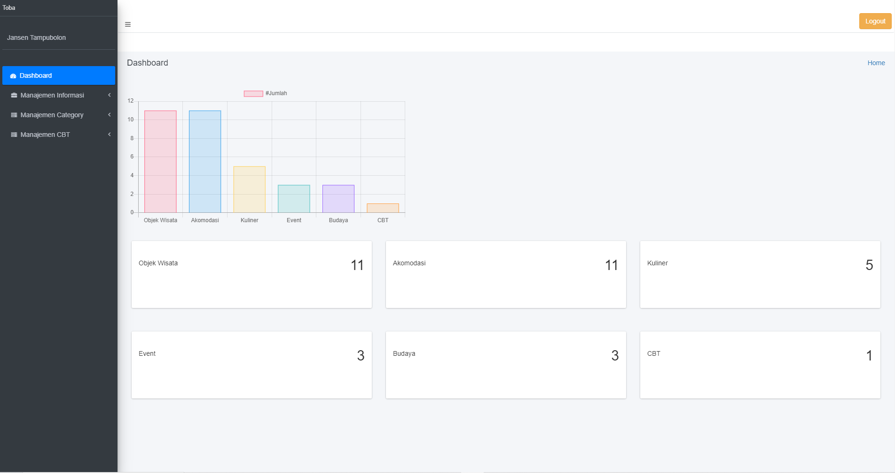
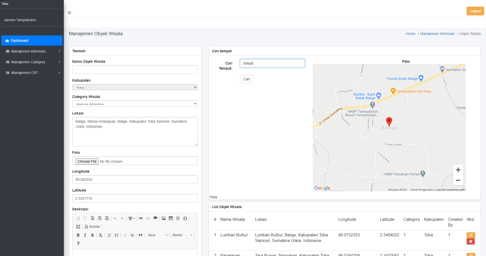

# Sistem Informasi Pariwisata di Kawasan Danau Toba

This system is Application based Website that using Laravel framework, Purpose of building this system is to 
inform the traveller who come from another country.beside that, we hope this system useful to them.

## 📸 ScreenShots

| Light                             		   | Dark                              			  |
| ---------------------------------------------|--------------------------------------------- |
|   |      |
|   		   |   |
|   	   | |

Langkah langkah menjalankan proyek :

1. Buat Folder baru
2. CMD kan
3. git clone https://github.com/andreas1009/PAIII_2020_05.git
4. masuk ke dalam folder yang baru terbentuk
5. composer install
6. copy .env.example .env
7. php artisan key:generate

--------------------------------   Berhasil run project   ----------------------------------

Langkah Langkah git pull origin master

1. git pull origin master-v2
2. php artisan migrate:fresh
3. composer dump-autoload
4. php artisan db:seed

